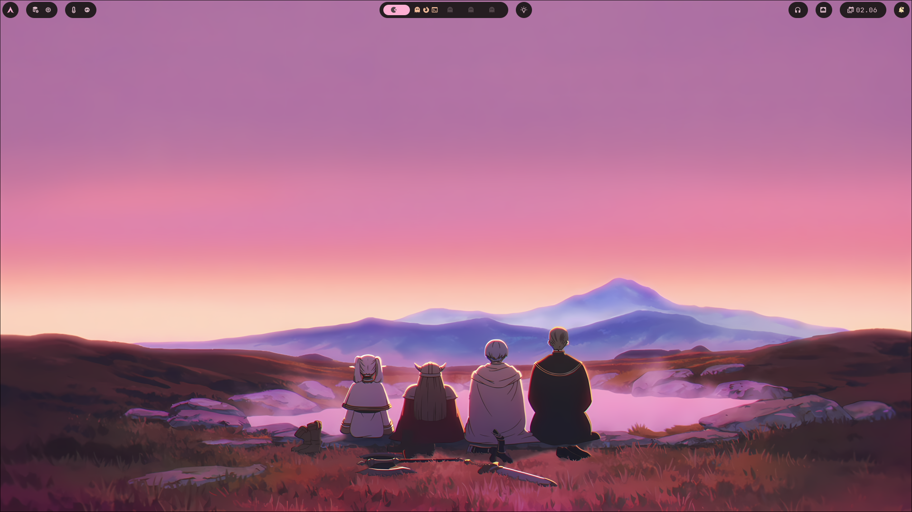
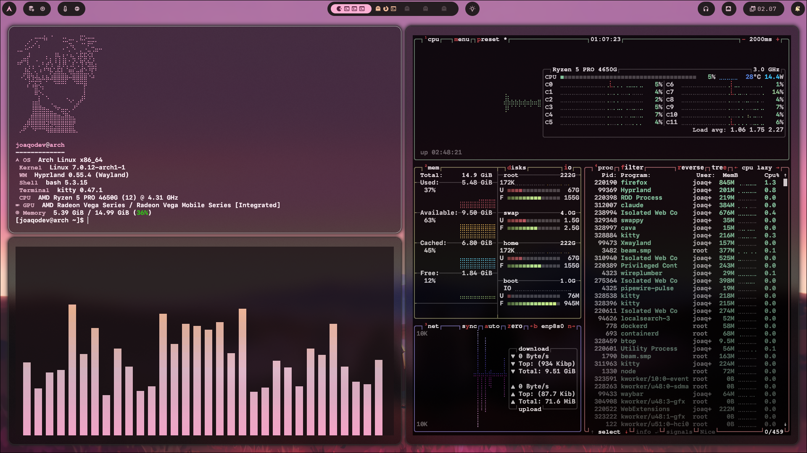
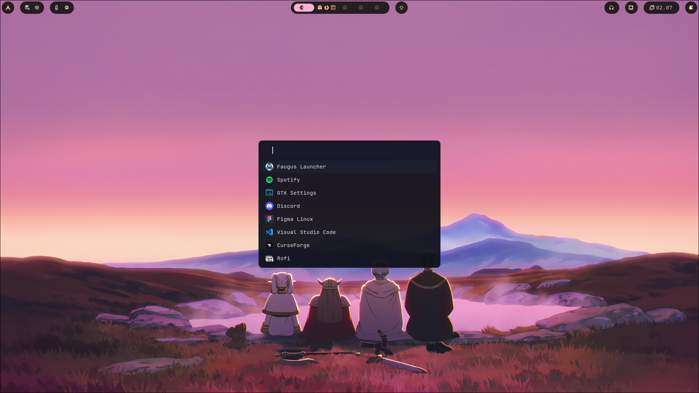
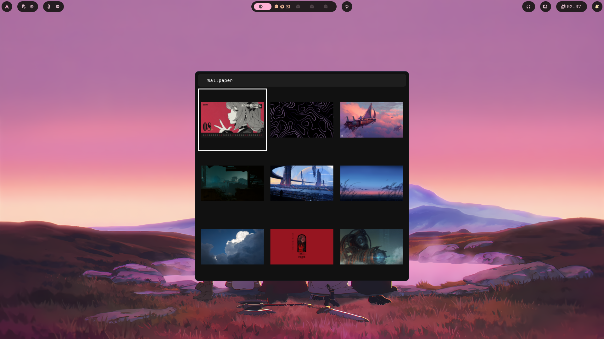

<div align="center">

# 🪟 Hyprland Dotfiles

### Mi configuración personal de Hyprland en Arch Linux

Un setup minimalista y dinámico, con temas generados automáticamente
desde el wallpaper usando **Material You** (`matugen`).

<br>


</div>

---

## 📸 Screenshots

<div align="center">

### 🖥️ Escritorio


### 🐱 Terminal — fastfetch · btop · cava


<br>




_Lanzador de aplicaciones · Selector de wallpaper_

</div>

---

## ✨ Componentes

| | Componente | Descripción |
|:-:|:--|:--|
| 🪟 | **[Hyprland](https://hyprland.org/)** | Compositor Wayland con tiling dinámico |
| 🌅 | **hyprsunset** | Filtro de luz azul (modo nocturno) |
| 📊 | **[Waybar](https://github.com/Alexays/Waybar)** | Barra de estado modular |
| 🐱 | **[Kitty](https://sw.kovidgoyal.net/kitty/)** | Emulador de terminal acelerado por GPU |
| 🚀 | **[Rofi](https://github.com/davatorium/rofi)** | Lanzador de aplicaciones |
| 🔔 | **[Mako](https://github.com/emersion/mako)** | Daemon de notificaciones |
| 🎨 | **[Matugen](https://github.com/InioX/matugen)** | Temas Material You generados del wallpaper |
| 🎵 | **[Cava](https://github.com/karlstav/cava)** | Visualizador de audio en la terminal |
| 💻 | **[Fastfetch](https://github.com/fastfetch-cli/fastfetch)** | Info del sistema |

---

## 🎨 Theming dinámico

Los colores de **Waybar, Cava, Mako y Fastfetch** se regeneran automáticamente
a partir del wallpaper gracias a `matugen`. Un solo wallpaper → toda la paleta
del escritorio se actualiza en conjunto.

```
wallpaper  ──▶  matugen  ──▶  waybar · cava · mako · fastfetch
```

---

## ⌨️ Keybinds principales

> Tecla modificadora (`$mainMod`) = **`SUPER`** (tecla Windows)

| Atajo | Acción |
|:--|:--|
| `SUPER` + `Q` | Abrir terminal (kitty) |
| `SUPER` + `R` | Lanzador de apps (rofi) |
| `SUPER` + `E` | Gestor de archivos (nautilus) |
| `SUPER` + `F` | Firefox |
| `SUPER` + `C` | Cerrar ventana |
| `SUPER` + `V` | Ventana flotante |
| `SUPER` + `SHIFT` + `F` | Pantalla completa |
| `SUPER` + `S` | Captura de región (hyprshot + swappy) |
| `SUPER` + `SHIFT` + `W` | Selector de wallpaper |
| `SUPER` + `←↑↓→` | Mover el foco entre ventanas |
| `SUPER` + `1`–`5` | Cambiar de workspace |

---

## 📦 Instalación

> [!WARNING]
> Hacé un backup de tu `~/.config` actual antes de copiar nada.

```bash
# 1. Clonar el repo
git clone https://github.com/joaqovrs/my-hyprland-dotfiles.git
cd my-hyprland-dotfiles

# 2. (Opcional) Backup de tu config actual
cp -a ~/.config ~/.config.bak

# 3. Copiar las configuraciones
cp -a .config/* ~/.config/
```

### Dependencias

```bash
sudo pacman -S hyprland waybar kitty rofi mako cava fastfetch
# matugen y hyprsunset están en el AUR:
yay -S matugen-bin hyprsunset
```

---

## 📂 Estructura

```
.config/
├── hypr/        # Hyprland + hyprsunset
├── waybar/      # Barra (config, módulos, estilos, tokens de color)
├── kitty/       # Terminal
├── rofi/        # Lanzador
├── mako/        # Notificaciones
├── matugen/     # Plantillas de theming Material You
├── cava/        # Visualizador de audio
└── fastfetch/   # Info del sistema
```

---
